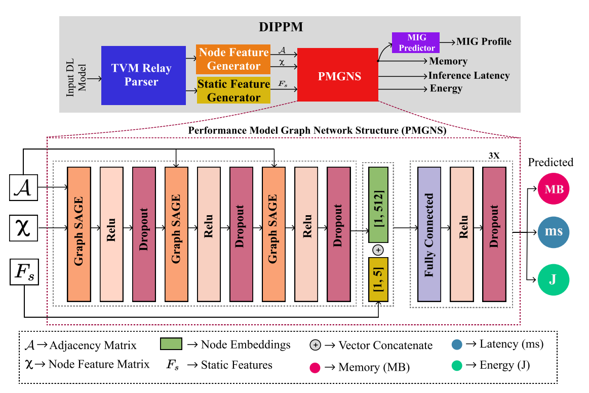

# DIPPM: a Deep Learning Inference Performance Predictive Model using Graph Neural Networks
We have developed a DL Inference Performance Predictive
Model (DIPPM) that predicts the inference latency, energy, and memory usage of a given input DL model on the NVIDIA A100 GPU. We also devised an algorithm to suggest the appropriate A100 Multi-Instance GPU profile from the output of DIPPM.

For more details: https://arxiv.org/abs/2303.11733




## Environment setup
```
# Prerequsite CUDA 11.7

pip install torch==1.13.1 torchvision==0.14.1

pip install torch-geometric==2.2.0

pip install https://data.pyg.org/whl/torch-1.13.0%2Bcu117/torch_cluster-1.6.0%2Bpt113cu117-cp310-cp310-linux_x86_64.whl

pip install https://data.pyg.org/whl/torch-1.13.0%2Bcu117/torch_scatter-2.1.0%2Bpt113cu117-cp310-cp310-linux_x86_64.whl

pip install https://data.pyg.org/whl/torch-1.13.0%2Bcu117/torch_sparse-0.6.16%2Bpt113cu117-cp310-cp310-linux_x86_64.whl

pip install pytorch_lightning==1.9.0

pip install networkx apache-tvm
```

## Dataset setup
```
git clone https://github.com/karthickai/deeplearning_inference

cd deeplearning_inference

sh dataset.sh
```

## Train the DIPPM
```
python train.py --model_type GraphSAGE --epoch 10
```

## To use DIPPM
```
import dippm
import torchvision

model = torchvision.models.vgg16(pretrained=True)
model.eval()

#current dippm supports only A100 GPU
out  = dippm.predict(model, batch=8, input="3,244,244", device="A100")
print("Predicted Memory {0} MB, Energy {1} J, Latency {2} ms, MIG {3}".format(*out))

```

## cite
```
@misc{selvam2023dippm,
      title={DIPPM: a Deep Learning Inference Performance Predictive Model using Graph Neural Networks}, 
      author={Karthick Panner Selvam and Mats Brorsson},
      year={2023},
      eprint={2303.11733},
      archivePrefix={arXiv},
      primaryClass={cs.PF}
}
```
